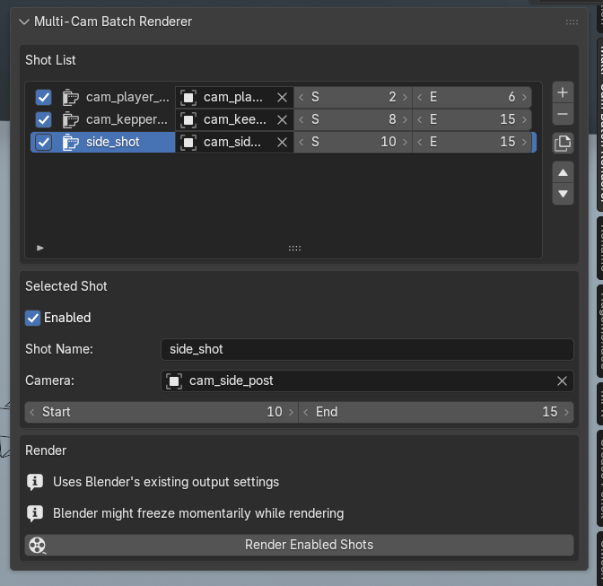

# Multi-Cam Batch Renderer

Render multiple camera shots from one Blender scene in a single batch using custom frame ranges.

## Overview

**Multi-Cam Batch Renderer** helps you set up several camera-based renders in advance so you do not have to manually:

- switch the active camera
- change the frame range
- render one shot
- repeat the process for another angle

Instead, you define a list of shots and let Blender render them one after another.

Each shot stores:

- **Enabled**
- **Shot Name**
- **Camera**
- **Start Frame**
- **End Frame**

This is especially useful for:

- rendering multiple angles of the same animation
- splitting one long scene into separate shot outputs
- preparing shots for later editing in Blender’s Video Sequencer

## Screenshot

## Features

- Add, remove, duplicate, and reorder shots
- Assign a camera to each shot
- Set custom frame ranges for each shot
- Enable or disable shots individually
- Render all enabled shots in sequence
- Use Blender’s existing output settings
- Restore the original scene settings after the batch is complete

## Location

Open Blender and go to:

**3D Viewport → Sidebar → Multi-Cam Batch Renderer**

## How to Use

1. Set up your normal Blender render settings first:
   
   - output path
   - file format
   - video codec or image format
   - resolution
   - frame rate
   - render engine

2. Open the **Multi-Cam Batch Renderer** panel.

3. Add a new shot.

4. For each shot, set:
   
   - **Shot Name**
   - **Camera**
   - **Start Frame**
   - **End Frame**
   - **Enabled**

5. Repeat for all the shots you want to render.

6. Click **Render Enabled Shots**.

The add-on will:

- switch to each shot’s camera
- apply its frame range
- append the shot name to the output path
- render the shot
- move to the next enabled shot
- restore the original scene settings when the batch is finished

## Example Workflow

Example shot list:

- `Wide_Shot` → Camera: `Cam_Wide` → Frames: `1–80`
- `Close_Up` → Camera: `Cam_Close` → Frames: `81–140`
- `Side_View` → Camera: `Cam_Side` → Frames: `141–220`

After setup, click **Render Enabled Shots** and let Blender render the full batch automatically.

You can later combine the rendered outputs in Blender’s Video Sequencer.

## Important Notes

### Blender might freeze momentarily while rendering

This add-on uses Blender’s normal render process. During rendering, Blender may appear frozen or temporarily unresponsive. That behavior is expected.

### Frame range validation

Make sure:

- the **camera is valid**
- the **start frame is correct**
- the **end frame is greater than or equal to the start frame**

### Uses Blender’s existing output settings

This add-on does **not** create a separate render configuration system.

It uses the current Blender scene settings for:

- output format
- codec
- resolution
- frame rate
- render engine
- output path base

## Good Use Cases

- Rendering multiple angles of the same scene
- Splitting one long scene into separate shot outputs
- Preparing renders for editing in Blender VSE
- Unattended batch rendering

## Current Scope

This version does not include:

- marker-based shot creation
- automatic camera cut detection
- VSE assembly
- per-shot render engine overrides
- per-shot resolution overrides
- per-shot world or lighting overrides

## Tips

- Use clear shot names for easier output organization
- Disable shots you do not want to render yet
- Duplicate a shot when you want a similar setup with a different frame range or camera
- Finalize Blender’s output settings before starting the batch

## 

## 

## License

GPL-3.0-or-later
